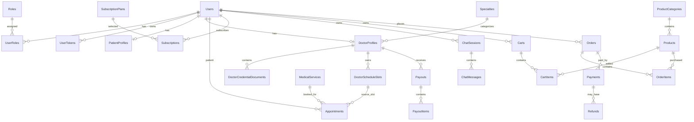

# Rehab AI Database Design

Target database: SQL Server  
ORM: Entity Framework Core  
Status: pre-migration design, synced with SRS v6.9 admin-created doctors

## 1. Design Decisions

- Use `uniqueidentifier` primary keys.
- Use `datetimeoffset` for timestamps.
- Use soft delete for business-critical data.
- Use relational lookup tables for roles, specialties, subscription plans, and payout items.
- Store doctor credential/license files in private storage. Database stores metadata only.
- Store token hashes in `UserTokens`, never raw email verification or password reset tokens. Development-only local test payloads may store raw helper tokens in `EmailLogs.MetadataJson`; this must remain disabled/null for production.
- Payments use one shared table, but each payment must point to exactly one target.
- `Users.Status` and roles are separate concepts:
  - status = account lifecycle
  - role = permission grouping

## 2. MVP Tables Before First Migration

Recommended MVP schema:

```text
Users
Roles
UserRoles
UserTokens
PatientProfiles
DoctorCredentialDocuments
DoctorProfiles
Specialties
MedicalServices
DoctorServices
DoctorScheduleSlots
Appointments
AppointmentStatusHistories
ProductCategories
Products
Carts
CartItems
Orders
OrderItems
Payments
PaymentWebhookEvents
Refunds
SubscriptionPlans
Subscriptions
ChatSessions
ChatMessages
AiUsageDaily
EmailLogs
AuditLogs
SystemSettings
```

Phase 2 tables:

```text
Disputes
Reviews
Payouts
PayoutItems
```

Product store and orders are included in MVP because SRS includes store/order flows and `Payments.OrderId` requires order tables to exist.

## 3. Identity And Access

### Users

| Column | Type | Notes |
|---|---|---|
| Id | uniqueidentifier | PK |
| FullName | nvarchar(150) | Required |
| Email | nvarchar(255) | Required, unique |
| PhoneNumber | nvarchar(30) | Nullable |
| PasswordHash | nvarchar(max) | Nullable until initial password setup |
| Status | int | Account lifecycle |
| EmailConfirmed | bit | Default false |
| CreatedAt | datetimeoffset | Required |
| UpdatedAt | datetimeoffset | Nullable |
| IsDeleted | bit | Soft delete |

Recommended indexes:

- `IX_Users_Email` unique
- `IX_Users_Status`

### Roles

| Column | Type | Notes |
|---|---|---|
| Id | uniqueidentifier | PK |
| Name | nvarchar(100) | Unique, e.g. Patient, Doctor, Admin, SupportStaff, FinanceAdmin |
| Description | nvarchar(500) | Nullable |
| CreatedAt | datetimeoffset | Required |
| UpdatedAt | datetimeoffset | Nullable |
| IsDeleted | bit | Soft delete |

### UserRoles

| Column | Type | Notes |
|---|---|---|
| UserId | uniqueidentifier | PK, FK Users.Id |
| RoleId | uniqueidentifier | PK, FK Roles.Id |

This keeps the design flexible for roles such as:

```text
AuthorizedInternalStaff
VerificationAdmin
SupportStaff
FinanceAdmin
```

### UserTokens

Used for email verification, password reset, and Admin-created Doctor password setup invitations.

| Column | Type | Notes |
|---|---|---|
| Id | uniqueidentifier | PK |
| UserId | uniqueidentifier | FK Users.Id |
| TokenType | int | EmailVerification, PasswordReset, DoctorInvitation |
| TokenHash | nvarchar(max) | Required, never store raw token |
| ExpiresAt | datetimeoffset | Required |
| UsedAt | datetimeoffset | Nullable |
| CreatedAt | datetimeoffset | Required |
| UpdatedAt | datetimeoffset | Nullable |
| IsDeleted | bit | Soft delete |

Rule:

- Tokens must be single-use.
- Expired or used tokens must be rejected.
- Users with `Status = PendingPasswordSetup` may have `PasswordHash = null`.
- Users with `Status = Active` must have `PasswordHash` set.

## 4. Profiles And Specialties

### PatientProfiles

| Column | Type | Notes |
|---|---|---|
| Id | uniqueidentifier | PK |
| UserId | uniqueidentifier | FK Users.Id, unique |
| DateOfBirth | date | Nullable |
| Gender | nvarchar(30) | Nullable |
| Address | nvarchar(500) | Nullable |
| ProfileImageUrl | nvarchar(500) | Nullable, public local profile image path for MVP |
| CreatedAt | datetimeoffset | Required |
| UpdatedAt | datetimeoffset | Nullable |
| IsDeleted | bit | Soft delete |

### Specialties

| Column | Type | Notes |
|---|---|---|
| Id | uniqueidentifier | PK |
| Name | nvarchar(150) | Required |
| Slug | nvarchar(150) | Required, unique |
| Description | nvarchar(1000) | Nullable |
| IsActive | bit | Required |
| CreatedAt | datetimeoffset | Required |
| UpdatedAt | datetimeoffset | Nullable |
| IsDeleted | bit | Soft delete |

### DoctorProfiles

| Column | Type | Notes |
|---|---|---|
| Id | uniqueidentifier | PK |
| UserId | uniqueidentifier | FK Users.Id, unique |
| SpecialtyId | uniqueidentifier | FK Specialties.Id |
| Bio | nvarchar(max) | Nullable |
| AvatarUrl | nvarchar(1000) | Nullable |
| PublicProfileApproved | bit | Required |
| PublicProfileReviewStatus | int | Required, Draft, Submitted, Approved, Rejected |
| SubmittedForReviewAt | datetimeoffset | Nullable |
| ReviewedAt | datetimeoffset | Nullable |
| ReviewedByAdminId | uniqueidentifier | Nullable, Admin user id |
| PublicProfileRejectionReason | nvarchar(1000) | Nullable, required when rejected |
| CommissionRate | decimal(5,2) | Required |
| CreatedAt | datetimeoffset | Required |
| UpdatedAt | datetimeoffset | Nullable |
| IsDeleted | bit | Soft delete |

Public doctor visibility requires all of:

```text
Users.Status = Active
DoctorProfiles.PublicProfileApproved = true
DoctorProfiles.PublicProfileReviewStatus = Approved
DoctorProfiles.IsDeleted = false
```

Available schedule slots are booking availability metadata. They are not required for public visibility after SRS v6.15; if no future available slot exists, Patients may still submit a flexible appointment request in a later booking slice.

## 5. Admin-Created Doctor Onboarding

SRS v6.9 removes public Doctor self-application. Doctor accounts are created internally by Admin or explicitly delegated authorized roles.

Doctor onboarding rule:

```text
Admin creates User with Doctor role
Users.Status = PendingPasswordSetup
DoctorProfile is created or prepared
DoctorCredentialDocuments are linked to DoctorProfile if stored in the platform
UserToken.TokenType = DoctorInvitation is sent by email
Doctor sets initial password with single-use token
Users.Status becomes Active after successful setup and policy checks
```

### DoctorCredentialDocuments

| Column | Type | Notes |
|---|---|---|
| Id | uniqueidentifier | PK |
| DoctorProfileId | uniqueidentifier | FK DoctorProfiles.Id |
| FileName | nvarchar(255) | Original file name |
| StorageKey | nvarchar(1000) | Private storage key, not public URL |
| ContentType | nvarchar(100) | JPG, PNG, PDF |
| SizeBytes | bigint | Required |
| MalwareScanStatus | nvarchar(50) | Pending, Clean, Failed |
| StorageSkippedByPolicy | bit | True if organization stores credentials outside platform |
| UploadedByUserId | uniqueidentifier | FK Users.Id, nullable |
| UploadedAt | datetimeoffset | Required |
| CreatedAt | datetimeoffset | Required |
| UpdatedAt | datetimeoffset | Nullable |
| IsDeleted | bit | Soft delete |

## 6. Services And Scheduling

### MedicalServices

| Column | Type | Notes |
|---|---|---|
| Id | uniqueidentifier | PK |
| Name | nvarchar(200) | Required |
| Description | nvarchar(max) | Nullable |
| DurationMinutes | int | Required |
| Price | decimal(18,2) | Required |
| Currency | nvarchar(10) | Default VND |
| OnlinePaymentEnabled | bit | Required |
| AutoConfirmEnabled | bit | Required |
| NoShowFeeEnabled | bit | Required, default false |
| NoShowFeeAmount | decimal(18,2) | Nullable |
| IsActive | bit | Required |
| CreatedAt | datetimeoffset | Required |
| UpdatedAt | datetimeoffset | Nullable |
| IsDeleted | bit | Soft delete |

### DoctorServices

| Column | Type | Notes |
|---|---|---|
| Id | uniqueidentifier | PK |
| DoctorProfileId | uniqueidentifier | FK DoctorProfiles.Id |
| MedicalServiceId | uniqueidentifier | FK MedicalServices.Id |
| IsActive | bit | Required |
| CreatedAt | datetimeoffset | Required |
| UpdatedAt | datetimeoffset | Nullable |
| IsDeleted | bit | Soft delete |

Recommended unique index:

- `DoctorProfileId + MedicalServiceId`

### DoctorScheduleSlots

`IsBookable` should not be the primary state. Use `Status`.

| Column | Type | Notes |
|---|---|---|
| Id | uniqueidentifier | PK |
| DoctorProfileId | uniqueidentifier | FK DoctorProfiles.Id |
| StartTime | datetimeoffset | Required |
| EndTime | datetimeoffset | Required |
| Status | int | Available, SoftReserved, Booked, Disabled |
| ReservedUntil | datetimeoffset | Nullable |
| CreatedByUserId | uniqueidentifier | FK Users.Id, nullable |
| UpdatedByUserId | uniqueidentifier | FK Users.Id, nullable |
| CreatedAt | datetimeoffset | Required |
| UpdatedAt | datetimeoffset | Nullable |
| IsDeleted | bit | Soft delete |

Recommended constraints/indexes:

- unique: `DoctorProfileId + StartTime + EndTime`
- index: `DoctorProfileId + Status + StartTime`
- index: `ReservedUntil`

Payment timeout rule:

```text
When a PendingPayment appointment expires,
DoctorScheduleSlots.Status returns to Available
and ReservedUntil is cleared.
```

## 7. Appointments

### Appointments

Direct slot bookings reference the source schedule slot, while also keeping time snapshots.
Flexible appointment requests do not reserve a schedule slot until a later scheduling decision, so the schedule slot FK is nullable.

| Column | Type | Notes |
|---|---|---|
| Id | uniqueidentifier | PK |
| PatientId | uniqueidentifier | FK Users.Id |
| DoctorProfileId | uniqueidentifier | FK DoctorProfiles.Id |
| MedicalServiceId | uniqueidentifier | FK MedicalServices.Id |
| DoctorScheduleSlotId | uniqueidentifier | FK DoctorScheduleSlots.Id, nullable for flexible appointment requests |
| StartTime | datetimeoffset | Snapshot |
| EndTime | datetimeoffset | Snapshot |
| Status | int | Requested, PendingPayment, Expired, Pending, Confirmed, Completed, Cancelled, NoShow, Rejected |
| Notes | nvarchar(max) | Nullable |
| CancellationReason | nvarchar(1000) | Nullable |
| CancelledByUserId | uniqueidentifier | FK Users.Id, nullable |
| CancelledAt | datetimeoffset | Nullable |
| SoftReservedUntil | datetimeoffset | Nullable |
| CreatedAt | datetimeoffset | Required |
| UpdatedAt | datetimeoffset | Nullable |
| IsDeleted | bit | Soft delete |

State machine:

```text
Requested -> PendingPayment
Requested -> Rejected
PendingPayment -> Expired
PendingPayment -> Pending
Pending -> Confirmed
Pending -> Cancelled
Confirmed -> Completed
Confirmed -> Cancelled
Confirmed -> NoShow
```

Flexible appointment request rules:

```text
Patient submits request to an Active, Admin-approved public Doctor without selecting DoctorScheduleSlotId.
Appointment.Status starts as Requested.
Doctor acceptance moves Requested -> PendingPayment for the existing payment placeholder flow.
Doctor rejection moves Requested -> Rejected.
Rejected reason is stored in CancellationReason for the MVP.
```

### AppointmentStatusHistories

| Column | Type | Notes |
|---|---|---|
| Id | uniqueidentifier | PK |
| AppointmentId | uniqueidentifier | FK Appointments.Id |
| FromStatus | int | Nullable |
| ToStatus | int | Required |
| ChangedByUserId | uniqueidentifier | FK Users.Id, nullable |
| Reason | nvarchar(1000) | Nullable |
| CreatedAt | datetimeoffset | Required |

## 8. Payments And Refunds

### Payments

One shared payment table is acceptable, but exactly one target FK must be non-null.

No-show fee rule:

```text
For PaymentPurpose = NoShowFee, AppointmentId must be non-null.
NoShowFee does not need a separate target table in MVP.
```

| Column | Type | Notes |
|---|---|---|
| Id | uniqueidentifier | PK |
| PaymentPurpose | int | Order, Appointment, Subscription, NoShowFee |
| OrderId | uniqueidentifier | FK Orders.Id, nullable |
| AppointmentId | uniqueidentifier | FK Appointments.Id, nullable |
| SubscriptionId | uniqueidentifier | FK Subscriptions.Id, nullable |
| Provider | nvarchar(50) | Stripe, VNPay, MoMo |
| ProviderSessionId | nvarchar(255) | Checkout/session ID |
| ProviderPaymentId | nvarchar(255) | Payment transaction ID |
| Amount | decimal(18,2) | Required |
| Currency | nvarchar(10) | VND, USD |
| Status | int | Pending, Paid, Failed, RefundPending, Refunded, RefundFailed, Cancelled |
| PaidAt | datetimeoffset | Nullable |
| FailedAt | datetimeoffset | Nullable |
| FailureReason | nvarchar(1000) | Nullable |
| RawWebhookJson | nvarchar(max) | Optional, redact secrets |
| CreatedAt | datetimeoffset | Required |
| UpdatedAt | datetimeoffset | Nullable |
| IsDeleted | bit | Soft delete |

SQL Server check constraint:

```sql
CHECK (
    (CASE WHEN OrderId IS NOT NULL THEN 1 ELSE 0 END) +
    (CASE WHEN AppointmentId IS NOT NULL THEN 1 ELSE 0 END) +
    (CASE WHEN SubscriptionId IS NOT NULL THEN 1 ELSE 0 END)
    = 1
)
```

### PaymentWebhookEvents

Used to make payment webhook handling idempotent and prevent duplicate processing when gateways retry events.

| Column | Type | Notes |
|---|---|---|
| Id | uniqueidentifier | PK |
| Provider | nvarchar(50) | Stripe, VNPay, MoMo |
| ProviderEventId | nvarchar(255) | Required |
| PaymentId | uniqueidentifier | FK Payments.Id, nullable |
| EventType | nvarchar(100) | Required |
| PayloadJson | nvarchar(max) | Required, redact secrets if needed |
| ProcessingStatus | int | Pending, Processed, Failed, IgnoredDuplicate |
| ProcessedAt | datetimeoffset | Nullable |
| CreatedAt | datetimeoffset | Required |
| UpdatedAt | datetimeoffset | Nullable |
| IsDeleted | bit | Soft delete |

Recommended unique index:

- `Provider + ProviderEventId`

### Refunds

| Column | Type | Notes |
|---|---|---|
| Id | uniqueidentifier | PK |
| PaymentId | uniqueidentifier | FK Payments.Id |
| ProviderRefundId | nvarchar(255) | Nullable |
| Amount | decimal(18,2) | Required |
| Status | int | Pending, Refunded, Failed |
| Reason | nvarchar(1000) | Nullable |
| CreatedAt | datetimeoffset | Required |
| UpdatedAt | datetimeoffset | Nullable |
| IsDeleted | bit | Soft delete |

## 9. Subscriptions

### SubscriptionPlans

| Column | Type | Notes |
|---|---|---|
| Id | uniqueidentifier | PK |
| Code | nvarchar(50) | Free, Pro, unique |
| Name | nvarchar(100) | Required |
| Price | decimal(18,2) | Required |
| DailyMessageLimit | int | Required |
| HistoryRetentionDays | int | Required |
| IsActive | bit | Required |

### Subscriptions

| Column | Type | Notes |
|---|---|---|
| Id | uniqueidentifier | PK |
| UserId | uniqueidentifier | FK Users.Id |
| PlanId | uniqueidentifier | FK SubscriptionPlans.Id |
| PlanCodeSnapshot | nvarchar(50) | Keeps historical plan code |
| Status | int | Inactive, Active, PastDue, Cancelled, Expired |
| CurrentPeriodStart | datetimeoffset | Nullable |
| CurrentPeriodEnd | datetimeoffset | Nullable |
| ProviderSubscriptionId | nvarchar(255) | Nullable |
| CreatedAt | datetimeoffset | Required |
| UpdatedAt | datetimeoffset | Nullable |
| IsDeleted | bit | Soft delete |

Rule:

```text
A user may have only one current subscription in Active, PastDue,
or Cancelled-until-period-end state.
```

Recommended filtered unique index:

```sql
CREATE UNIQUE INDEX UX_Subscriptions_User_Current
ON Subscriptions(UserId)
WHERE Status IN (2, 3, 4);
```

## 10. Chatbot And AI Usage

### ChatSessions

| Column | Type | Notes |
|---|---|---|
| Id | uniqueidentifier | PK |
| UserId | uniqueidentifier | FK Users.Id, nullable for Guest |
| GuestSessionId | nvarchar(200) | Nullable |
| LinkedFromGuestSessionId | nvarchar(200) | Nullable |
| LinkedAt | datetimeoffset | Nullable |
| Title | nvarchar(200) | Nullable |
| CreatedAt | datetimeoffset | Required |
| UpdatedAt | datetimeoffset | Nullable |
| IsDeleted | bit | Soft delete |

### ChatMessages

| Column | Type | Notes |
|---|---|---|
| Id | uniqueidentifier | PK |
| ChatSessionId | uniqueidentifier | FK ChatSessions.Id |
| Role | int | User, Assistant, System, Tool |
| Content | nvarchar(max) | Encrypt if health-related |
| MetadataJson | nvarchar(max) | Nullable |
| CreatedAt | datetimeoffset | Required |
| UpdatedAt | datetimeoffset | Nullable |
| IsDeleted | bit | Soft delete |

### AiUsageDaily

| Column | Type | Notes |
|---|---|---|
| Id | uniqueidentifier | PK |
| UserId | uniqueidentifier | FK Users.Id, nullable |
| GuestSessionId | nvarchar(200) | Nullable |
| UsageDate | date | Required |
| MessageCount | int | Required |
| TokenCount | int | Required |
| CostAmount | decimal(18,6) | Nullable |

Recommended filtered unique indexes:

```sql
CREATE UNIQUE INDEX UX_AiUsageDaily_User_Date
ON AiUsageDaily(UserId, UsageDate)
WHERE UserId IS NOT NULL;

CREATE UNIQUE INDEX UX_AiUsageDaily_Guest_Date
ON AiUsageDaily(GuestSessionId, UsageDate)
WHERE GuestSessionId IS NOT NULL;
```

## 11. MVP Commerce

Commerce tables are included in MVP because SRS includes store/order flows and `Payments.OrderId` requires the order tables to exist in the initial migration.

### ProductCategories

| Column | Type | Notes |
|---|---|---|
| Id | uniqueidentifier | PK |
| Name | nvarchar(200) | Required |
| Slug | nvarchar(200) | Required, unique |
| CreatedAt | datetimeoffset | Required |
| UpdatedAt | datetimeoffset | Nullable |
| IsDeleted | bit | Soft delete |

### Products

| Column | Type | Notes |
|---|---|---|
| Id | uniqueidentifier | PK |
| CategoryId | uniqueidentifier | FK ProductCategories.Id |
| Name | nvarchar(200) | Required |
| Slug | nvarchar(200) | Required, unique |
| Description | nvarchar(max) | Nullable |
| Price | decimal(18,2) | Required |
| Currency | nvarchar(10) | Default VND |
| StockQuantity | int | Required |
| ImageUrl | nvarchar(1000) | Nullable |
| IsActive | bit | Required |
| CreatedAt | datetimeoffset | Required |
| UpdatedAt | datetimeoffset | Nullable |
| IsDeleted | bit | Soft delete |

### Carts

| Column | Type | Notes |
|---|---|---|
| Id | uniqueidentifier | PK |
| UserId | uniqueidentifier | FK Users.Id |
| CreatedAt | datetimeoffset | Required |
| UpdatedAt | datetimeoffset | Nullable |
| IsDeleted | bit | Soft delete |

### CartItems

| Column | Type | Notes |
|---|---|---|
| Id | uniqueidentifier | PK |
| CartId | uniqueidentifier | FK Carts.Id |
| ProductId | uniqueidentifier | FK Products.Id |
| Quantity | int | Required |
| UnitPrice | decimal(18,2) | Snapshot |
| CreatedAt | datetimeoffset | Required |
| UpdatedAt | datetimeoffset | Nullable |
| IsDeleted | bit | Soft delete |

### Orders

| Column | Type | Notes |
|---|---|---|
| Id | uniqueidentifier | PK |
| UserId | uniqueidentifier | FK Users.Id |
| OrderNumber | nvarchar(50) | Required, unique |
| Status | int | PendingPayment, Paid, Processing, Shipped, Completed, Cancelled, Refunded |
| PaymentStatus | int | Pending, Paid, Failed, RefundPending, Refunded, RefundFailed |
| TotalAmount | decimal(18,2) | Required |
| Currency | nvarchar(10) | Default VND |
| ShippingAddress | nvarchar(1000) | Nullable MVP field |
| CreatedAt | datetimeoffset | Required |
| UpdatedAt | datetimeoffset | Nullable |
| IsDeleted | bit | Soft delete |

### OrderItems

Orders should store snapshots such as product name and unit price to preserve order history.

| Column | Type | Notes |
|---|---|---|
| Id | uniqueidentifier | PK |
| OrderId | uniqueidentifier | FK Orders.Id |
| ProductId | uniqueidentifier | FK Products.Id |
| ProductName | nvarchar(200) | Snapshot |
| Quantity | int | Required |
| UnitPrice | decimal(18,2) | Snapshot |
| Subtotal | decimal(18,2) | Quantity * UnitPrice snapshot |
| CreatedAt | datetimeoffset | Required |
| UpdatedAt | datetimeoffset | Nullable |
| IsDeleted | bit | Soft delete |

## 12. Phase 2 Reviews, Disputes, Payouts

### Reviews

Use `Status`, not only `IsVisible`.

```text
Visible
Hidden
Flagged
Removed
```

### Payouts And PayoutItems

`Payouts` stores the payout batch/header.  
`PayoutItems` stores which completed appointments contributed to that payout.

```text
Payouts 1--many PayoutItems
PayoutItems many--1 Appointments
```

Without `PayoutItems`, the system cannot explain earnings by appointment.

## 13. System Settings

### SystemSettings

| Column | Type | Notes |
|---|---|---|
| Id | uniqueidentifier | PK |
| SettingKey | nvarchar(100) | Unique |
| SettingValue | nvarchar(max) | Required |
| ValueType | nvarchar(50) | string, int, decimal, bool, json |
| Description | nvarchar(500) | Nullable |
| UpdatedByUserId | uniqueidentifier | FK Users.Id, nullable |
| UpdatedAt | datetimeoffset | Nullable |

Example settings:

```text
Appointment.SoftReserveMinutes = 10
Appointment.CancellationDeadlineHours = 24
Platform.DefaultCommissionRate = 15
Payment.WebhookRetryMaxAttempts = 5
```

## 14. Email And Audit

### EmailLogs

Tracks sending status for account verification, invitation password setup, appointment, order, payment, and subscription emails.

| Column | Type | Notes |
|---|---|---|
| Id | uniqueidentifier | PK |
| UserId | uniqueidentifier | FK Users.Id, nullable |
| ToEmail | nvarchar(255) | Required |
| Subject | nvarchar(255) | Required |
| TemplateName | nvarchar(100) | Required |
| Status | nvarchar(50) | Pending, Sent, Failed |
| ErrorMessage | nvarchar(max) | Nullable |
| MetadataJson | nvarchar(max) | Nullable, Development-only payload for local test tokens/links; do not store production secrets |
| SentAt | datetimeoffset | Nullable |
| CreatedAt | datetimeoffset | Required |
| UpdatedAt | datetimeoffset | Nullable |
| IsDeleted | bit | Soft delete |

### AuditLogs

| Column | Type | Notes |
|---|---|---|
| Id | uniqueidentifier | PK |
| ActorUserId | uniqueidentifier | FK Users.Id, nullable for system |
| Action | nvarchar(150) | Required |
| EntityName | nvarchar(150) | Required |
| EntityId | uniqueidentifier | Nullable |
| IpAddress | nvarchar(100) | Nullable |
| MetadataJson | nvarchar(max) | Nullable |
| CreatedAt | datetimeoffset | Required |

Audit logs should be immutable and should not be soft-deleted.

## 15. Relationship Summary



## 16. Migration Recommendation

Before creating `InitialCreate`, confirm:

- Product store is MVP or phase 2.
- Appointment online payment is MVP or phase 2.
- Subscription Pro plan is MVP or phase 2.
- Doctor accounts are created internally by Admin using UC-31.
- File storage provider: local private storage, Azure Blob, S3, or Cloudinary.

Commands:

```powershell
dotnet ef migrations add InitialCreate -p src/RehabAI.Infrastructure -s src/RehabAI.Api
dotnet ef database update -p src/RehabAI.Infrastructure -s src/RehabAI.Api
```
